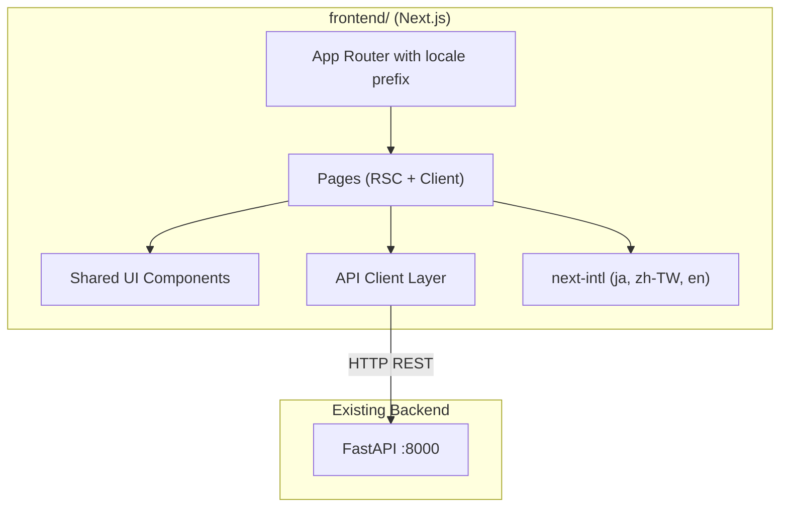
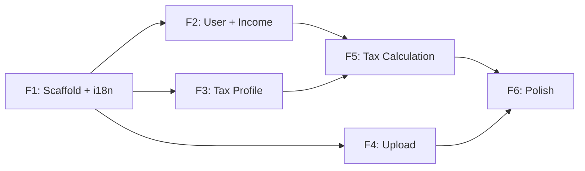

# TaxPilot Frontend — Multi-Language Reference UI

## Tech Stack

- **Framework:** Next.js 14+ (App Router) — provides built-in i18n routing, SSR, and file-based routing
- **Language:** TypeScript
- **UI Library:** shadcn/ui + Tailwind CSS — modern, accessible components with minimal bundle size
- **i18n:** next-intl — tight Next.js App Router integration, supports namespaced translations
- **HTTP Client:** Built-in `fetch` with a thin API wrapper targeting the existing FastAPI backend
- **Form Handling:** React Hook Form + Zod — schema-driven validation (pairs well with dynamic ProfileDefinition)
- **State:** React Server Components by default; client state only where needed (form inputs, modals)
- **Container:** Node 20 Alpine Docker image, added as `frontend` service in `docker-compose.yml`

## Architecture




## Directory Structure

```
frontend/
├── Dockerfile
├── package.json
├── next.config.ts
├── tailwind.config.ts
├── tsconfig.json
├── messages/                  # i18n translation files
│   ├── en.json
│   ├── ja.json
│   └── zh-TW.json
├── src/
│   ├── i18n/                  # next-intl config
│   │   ├── request.ts
│   │   └── routing.ts
│   ├── lib/
│   │   └── api-client.ts      # Typed fetch wrapper for FastAPI
│   ├── components/
│   │   ├── ui/                # shadcn/ui primitives
│   │   ├── layout/            # Header, Sidebar, Footer, LocaleSwitcher
│   │   └── shared/            # DataTable, FormField, FileUpload, etc.
│   └── app/
│       └── [locale]/          # Locale-prefixed routes
│           ├── layout.tsx     # Root layout with nav + locale provider
│           ├── page.tsx       # Dashboard / home
│           ├── income/
│           │   ├── page.tsx   # Income list
│           │   └── new/page.tsx
│           ├── profile/
│           │   └── [year]/page.tsx  # Dynamic tax profile form
│           ├── upload/
│           │   └── page.tsx   # Document upload
│           └── calculate/
│               └── [year]/page.tsx  # Tax calculation results
```

## i18n Strategy

- URL-based locale: `/en/income`, `/ja/income`, `/zh-TW/income`
- Translation files organized by namespace in `messages/{locale}.json` (e.g., `common`, `income`, `profile`, `calculate`)
- `LocaleSwitcher` component in the header for runtime switching
- Default locale: `ja` (primary audience is Japanese tax filers)
- Pydantic field descriptions from the API remain in English (agent-facing); the frontend maps field keys to localized labels

## Integration with Docker Compose

Add a `frontend` service to the existing [docker-compose.yml](docker-compose.yml):

```yaml
frontend:
  build:
    context: ./frontend
  ports:
    - "${FRONTEND_PORT:-3000}:3000"
  depends_on:
    - api
  environment:
    - NEXT_PUBLIC_API_BASE=http://api:8000
```

Add `FRONTEND_PORT=3000` to `.env.example`.

---

## Phase Breakdown

Each phase is a self-contained design doc under `docs/design/` with a focused scope. Each phase produces a working, testable increment.

### Phase F1: Scaffold and i18n Foundation

**Goal:** Bootable Next.js app with working i18n routing, layout shell, and Docker integration.

**Deliverables:**

- `frontend/` directory with Next.js 14, TypeScript, Tailwind CSS, shadcn/ui init
- `Dockerfile` (Node 20 Alpine, multi-stage build)
- `docker-compose.yml` updated with `frontend` service
- next-intl configured with locale routing (`/ja`, `/en`, `/zh-TW`)
- Translation files: `messages/ja.json`, `messages/en.json`, `messages/zh-TW.json` (common namespace only)
- Root layout with: Header (app title, LocaleSwitcher), Sidebar navigation (placeholder links), main content area
- Home page (`/[locale]/`) showing a welcome message in the selected locale
- `lib/api-client.ts` — typed wrapper with `getHealth()` calling `GET /health`
- Health status indicator in the footer (verifies frontend-to-backend connectivity)
- Makefile targets: `make frontend-dev`, `make frontend-build`

**Key files:** `frontend/Dockerfile`, `frontend/src/i18n/`, `frontend/src/app/[locale]/layout.tsx`, `frontend/messages/*.json`

---

### Phase F2: User and Income Entry Management

**Goal:** Full CRUD for income entries with localized forms and table views.

**Deliverables:**

- API client methods: `createUser`, `getUser`, `createIncomeEntry`, `listIncomeEntries`, `getIncomeEntry`, `deleteIncomeEntry`
- User context/session: Simple user ID storage (localStorage or URL param — no auth yet)
- User creation page or onboarding flow (minimal: just display_name input)
- Income list page (`/[locale]/income`): DataTable with columns for date, type, gross amount, taxes; delete action
- Income create page (`/[locale]/income/new`): Form with fields mapped from `IncomeEntryCreate` schema — income_type dropdown (localized labels for SALARY/BONUS/OTHER), amount fields with JPY formatting
- Translation namespace: `income` with field labels and validation messages in ja/en/zh-TW
- Loading and error states for all API calls

**Key files:** `frontend/src/app/[locale]/income/`, `frontend/src/lib/api-client.ts`, `frontend/messages/*.json` (income namespace)

---

### Phase F3: Tax Profile and Schema-Driven Dynamic Fields

**Goal:** Tax profile editor that dynamically renders fields based on ProfileDefinition from the backend.

**Deliverables:**

- API client methods: `getTaxProfile`, `updateTaxProfile`, `getProfileDefinition`
- Profile page (`/[locale]/profile/[year]`): Year selector; core fields (has_spouse, dependents_count, etc.) as standard form inputs; dynamic fields section rendered from `ProfileDefinition.schema_definition` JSONB
- Dynamic form renderer: Takes the JSONB schema from `GET /profile-definition/{year}` and generates form fields (text, number, boolean, select) with localized labels (field key mapped to translation key)
- Translation namespace: `profile` with core field labels and dynamic field labels per year
- Validation: Zod schema generated at runtime from ProfileDefinition

**Key files:** `frontend/src/app/[locale]/profile/`, `frontend/src/components/shared/DynamicFormRenderer.tsx`

---

### Phase F4: Document Upload and Ingestion

**Goal:** Drag-and-drop file upload UI for financial document ingestion.

**Deliverables:**

- API client method: `uploadDocument` (multipart/form-data to `POST /ingestion/upload`)
- Upload page (`/[locale]/upload`): Drag-and-drop zone (accept PDF, Excel, images); upload progress indicator; result display showing the created IncomeEntry with extracted data
- Upload history: Link to income entries page filtered by source_file
- Translation namespace: `upload` with instructions, supported formats, error messages
- Error handling: File too large, unsupported format, extraction failure — all localized

**Key files:** `frontend/src/app/[locale]/upload/`, `frontend/src/components/shared/FileUpload.tsx`

---

### Phase F5: Tax Calculation Dashboard

**Goal:** Run tax calculations and display detailed results with a visual breakdown.

**Deliverables:**

- API client method: `calculateTax` (`POST /tax/calculate/{user_id}/{year}`)
- Calculation page (`/[locale]/calculate/[year]`): "Calculate" button; results panel showing all fields from `TaxCalculationResult` (gross salary, deductions breakdown, taxable income, income tax, furusato limit)
- Visual breakdown: Bar chart or stacked breakdown of deductions vs taxable income (lightweight — use recharts or a CSS-only solution)
- Furusato nozei limit highlighted prominently (key user-facing value)
- Print/export: Simple print-friendly CSS layout
- Translation namespace: `calculate` with all result field labels and explanatory notes

**Key files:** `frontend/src/app/[locale]/calculate/`, `frontend/src/components/shared/TaxBreakdownChart.tsx`

---

### Phase F6: Polish, Responsive Design, and Accessibility

**Goal:** Production-ready UI with full responsive layout, accessibility, and error resilience.

**Deliverables:**

- Responsive design: Mobile-first layouts for all pages (sidebar collapses to hamburger menu)
- Accessibility: ARIA labels, keyboard navigation, focus management, color contrast compliance (WCAG 2.1 AA)
- Global error boundary with localized fallback UI
- Toast notifications for success/error feedback (localized)
- Loading skeletons for all data-fetching pages
- SEO: Locale-specific meta tags, canonical URLs
- README update with frontend section
- End-to-end smoke test (optional): Playwright test for core flow (create user -> add income -> calculate)

**Key files:** All layout/component files, `frontend/src/components/ui/`, README.md

---

## Dependency Graph




F2, F3, and F4 can be developed in parallel after F1. F5 depends on F2 and F3 (needs user + income + profile data). F6 is the final polish pass.