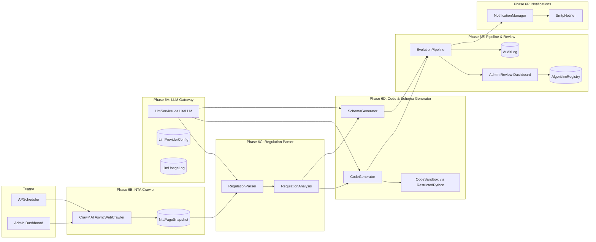
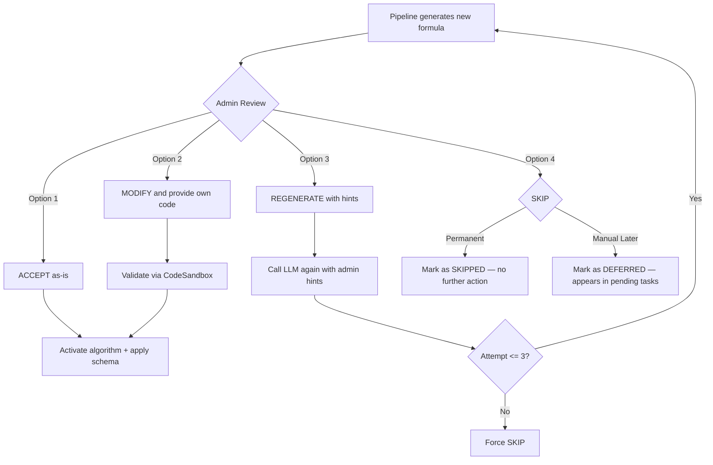

# Evolution Loop — Overview

**Purpose:** Master overview of the Evolution Loop feature. This document ties all sub-phases together and defines cross-cutting concerns (security, technology choices, audit). It is the "map" for humans — not intended for Cursor to implement directly.

---

## System Context

The Evolution Loop is a self-evolving capability layered on top of the deterministic Tax Calculation Engine (Phases 1–5). It continuously monitors Japan's National Tax Agency (NTA) for regulation changes and uses LLMs to generate updated tax calculation algorithms and schema definitions for admin review and approval.

### End-to-End Pipeline (Mermaid)



---

## Phase Breakdown

| Phase | Name | Goal | Depends On | Key Deliverables |
|-------|------|------|------------|------------------|
| 6A | LLM Gateway | Multi-provider LLM integration via LiteLLM | Phase 5 | `LlmService`, encrypted token storage, cost tracking, Streamlit config |
| 6B | NTA Crawler | Persistent web crawler with LLM-optimized markdown | Phase 2 | `NtaMonitor` via Crawl4AI, `NtaPageSnapshot` with markdown, admin monitor page |
| 6C | Regulation Parser | Parse NTA content into structured change descriptions | 6A + 6B | `RegulationParser`, `RegulationAnalysis` Pydantic model, prompt templates |
| 6D | Code & Schema Generator | Generate algorithm code + schema proposals | 6A + 6C | `CodeGenerator`, `SchemaGenerator`, `CodeSandbox` via RestrictedPython |
| 6-Pre | Bootstrap & Verification | Cold start: seed registry, baseline crawl, LLM verification | 6A + 6B + 6C + 6D | Populated `AlgorithmRegistry`, baseline NTA snapshots, verification report, migrated `tax_service.py` |
| 6E | Pipeline & Admin Review | End-to-end orchestration with 4-option approval flow | All previous | `EvolutionPipeline`, enhanced Streamlit review dashboard, audit trail, rollback |
| 6F | Notifications | Email alerts for pipeline events | 6E | `SmtpNotifier`, email templates, notification preferences |

### Phase Dependency Graph

```
Phase 6A (LLM Gateway)       Phase 6B (NTA Crawler)
    |                              |
    +--------+---------------------+
             |
             v
Phase 6C (Regulation Parser)
             |
             v
Phase 6D (Code & Schema Generator)
             |
             v
Phase 6-Pre (Bootstrap & Verification)
             |
             v
Phase 6E (Pipeline Orchestration & Admin Review)
             |
             v
Phase 6F (Email Notifications)
```

Notes:

- 6A and 6B can be developed **in parallel** (no dependency on each other)
- 6-Pre depends on 6A + 6B + 6C + 6D (needs all components for cold-start verification)
- 6-Pre must complete before 6E (the pipeline needs registered algorithms and baseline snapshots)
- 6F depends on 6E (needs pipeline events to trigger notifications)
- 6F can optionally be developed in parallel with 6E if the notification interface is defined first

---

## Admin Approval Decision Tree

When the pipeline generates a new formula, the admin has 4 options:



| Decision | Action | DB Status |
|----------|--------|-----------|
| **ACCEPT** | Activate new algorithm, archive previous, apply schema changes | `ACCEPTED` → `ACTIVE` |
| **MODIFY** | Admin edits code, runs through CodeSandbox validation, then activate | `MODIFIED` → `ACTIVE` |
| **REGENERATE** | Send hints to LLM, generate new attempt (max 3) | `REGENERATING` → `GENERATING` |
| **SKIP_PERMANENT** | Ignore this regulation change permanently | `SKIPPED` |
| **SKIP_MANUAL** | Defer for manual handling later | `DEFERRED` |

---

## Cross-Cutting Security Design

These security measures apply across **all** phases. Each phase document also includes its own phase-specific security section.

### 1. API Token Encryption

- **Library:** `cryptography` (Fernet symmetric encryption)
- **At rest:** API tokens (LLM providers, SMTP) are encrypted in the DB using Fernet
- **In memory:** Decrypted only during the actual API call, then discarded
- **Key management:** `LLM_ENCRYPTION_KEY` loaded from environment variable, never hardcoded
- **API masking:** Token values returned via API are always masked (e.g., `sk-...a3f2`)
- **Production note:** For production, wrap Fernet with envelope encryption via cloud KMS (AWS KMS, GCP KMS)

### 2. Data Boundary — No User PII to LLMs

- Only **public NTA regulation text** (crawled from government websites) is sent to LLMs
- **Never** send user financial data, names, or any PII to external LLM providers
- Prompt templates are version-controlled in `domain/prompts.py` and auditable
- Each prompt is logged with a hash (not the full content) for traceability

### 3. Generated Code Sandboxing

- **Library:** RestrictedPython (v8.1+, MIT license)
- **Mechanism:** `compile_restricted()` compiles code with AST-level restrictions
- **Builtins:** Only `safe_builtins` are available (blocks `open`, `exec`, `eval`, `import`, `__import__`)
- **Attribute access:** `safer_getattr` guards prevent access to `__dict__`, `__class__`, and other dunder attributes
- **Deny-by-default:** Any Python language feature without an explicit RestrictedPython handler is blocked
- **Domain checks:** Function name must match expected name; signature must match existing algorithm
- **Execution policy:** Generated code is NEVER executed until admin explicitly approves and activates

### 4. Admin Authentication

- Streamlit dashboard protected by admin password (env var `ADMIN_PASSWORD`)
- All `/admin/*` API endpoints require authentication
- Session-based auth for Streamlit; API key or Basic Auth for REST endpoints (MVP)
- Production note: Integrate with OIDC/SSO for production deployments

### 5. Audit Trail

All significant actions are logged to the `AuditLog` table:

```
AuditLog:
  id: int (PK)
  action: str          # e.g., "ALGORITHM_ACTIVATED", "REVIEW_DECISION", "CONFIG_CHANGED"
  actor: str           # admin username or "system"
  target_type: str     # e.g., "AlgorithmRegistry", "LlmProviderConfig"
  target_id: str       # ID of the affected entity
  details: JSONB       # action-specific context (decision, rationale, etc.)
  created_at: datetime
```

Audited actions include:
- LLM provider configuration changes
- Target page additions/modifications
- Algorithm activation/archival
- Review decisions (all 4 types) with rationale
- Schema changes applied
- Rollback operations
- Notification configuration changes

### 6. Rollback Strategy

- When a new algorithm is activated, the previous version is set to `ARCHIVED` — never deleted
- `ProfileDefinition` changes are versioned — old definitions are preserved
- Admin can trigger a one-click rollback via the dashboard:
  1. Re-activate the previous `ARCHIVED` algorithm
  2. Restore the previous `ProfileDefinition` for that year
  3. Log the rollback to `AuditLog`
- NTA snapshots are immutable — they are never modified after creation

---

## Technology Choices & Rationale

| Technology | Purpose | Why This Choice |
|------------|---------|-----------------|
| **LiteLLM** (v1.81+, MIT) | Multi-provider LLM access | Unified `completion()` call for 100+ providers; built-in cost tracking, retries, streaming; Pydantic `response_format` for structured output. Replaces 3 custom adapters. |
| **RestrictedPython** (v8.1+, MIT) | Code sandboxing | AST-level restriction with `compile_restricted()` and `safe_builtins`; deny-by-default; actively maintained for Python 3.9–3.13. Replaces custom AST blocklist. |
| **Crawl4AI** (v0.7.8+, MIT) | NTA web crawling | Async-native; produces `raw_markdown` and `fit_markdown` (LLM-optimized via `PruningContentFilter`); preserves tables; no JS rendering overhead for static NTA pages. |
| **Fernet** (`cryptography`) | Token encryption at rest | Simple, symmetric encryption; sufficient for MVP. Production: envelope encryption via cloud KMS. |
| **aiosmtplib** | Async email notifications | Async SMTP compatible with FastAPI's event loop. Pluggable interface allows future SendGrid/SES migration. |
| **APScheduler** | Periodic crawler scheduling | Lightweight, in-process scheduler. Production note: migrate to ARQ + Redis for distributed job queuing. |
| **Streamlit** | Admin dashboard (MVP) | Rapid prototyping; built-in widgets for forms, tables, code editors. Production note: migrate to Starlette Admin for deeper FastAPI integration. |

---

## Notification Event Catalog

These events are defined in Phase 6F but referenced across all phases:

| Event | Trigger | Phase |
|-------|---------|-------|
| `REGULATION_CHANGE_DETECTED` | NTA crawler detects a page content change | 6B |
| `FORMULA_READY_FOR_REVIEW` | Pipeline finishes generating code/schema, enters `AWAITING_REVIEW` | 6E |
| `FORMULA_ACTIVATED` | Admin accepts or modifies and activates a formula | 6E |
| `FORMULA_REGENERATING` | Admin requests LLM regeneration | 6E |
| `RUN_FAILED` | Pipeline fails at any step | 6E |
| `DEFERRED_REMINDER` | Weekly digest of deferred runs awaiting manual handling | 6F |

---

## Concrete Example Walkthrough: 2024 "Fixed Tax Cut" (定額減税)

This walkthrough traces how the Evolution Loop would handle the 2024 Fixed Tax Cut — a one-time 30,000 JPY income tax reduction per person (taxpayer + dependents) introduced mid-year.

### Step 1: Detection (Phase 6B)

The NTA Crawler's scheduled run fetches `https://www.nta.go.jp/taxes/shiraberu/taxanswer/shotoku/2260.htm`. The `fit_markdown` hash differs from the previous snapshot — new content mentions "定額減税" (fixed tax cut) with a 30,000 JPY per-person credit.

### Step 2: Parsing (Phase 6C)

The `RegulationParser` sends the `fit_markdown` to the LLM with the regulation parsing prompt. The LLM returns:

```json
{
  "changes": [
    {
      "change_type": "NEW_DEDUCTION",
      "affected_function": "calc_income_tax",
      "old_value": "N/A",
      "new_value": "30,000 JPY credit per person (taxpayer + dependents)",
      "description": "2024 Fixed Tax Cut: reduce income tax by 30,000 per eligible person",
      "confidence_score": 0.95
    },
    {
      "change_type": "NEW_FIELD_REQUIRED",
      "affected_function": "calc_income_tax",
      "old_value": "N/A",
      "new_value": "fixed_tax_cut_eligible_count: int",
      "description": "New field needed: number of persons eligible for the fixed tax cut",
      "confidence_score": 0.90
    }
  ],
  "summary": "2024 Fixed Tax Cut (定額減税): 30,000 JPY income tax credit per taxpayer and each dependent",
  "tax_year": 2024
}
```

### Step 3: Code Generation (Phase 6D)

The `CodeGenerator` receives the `LawChange` objects and the current `calc_income_tax` code. The LLM generates an updated function that subtracts `30,000 * eligible_count` from the calculated tax. The code passes `CodeSandbox.validate()` via RestrictedPython.

The `SchemaGenerator` proposes a new field `fixed_tax_cut_eligible_count` (int, required, default 1) for the 2024 `ProfileDefinition`.

### Step 4: Admin Review (Phase 6E)

The admin receives an email notification (`FORMULA_READY_FOR_REVIEW`). In the Streamlit dashboard, they see:

- **Side-by-side diff** of the current vs proposed `calc_income_tax` function
- **New field proposal:** `fixed_tax_cut_eligible_count` in the TaxProfile schema
- **LLM confidence:** 0.95 for the code change, 0.90 for the new field

The admin verifies the formula against the NTA page (they can copy the stored `fit_markdown` and paste it into their own LLM for independent verification), then clicks **ACCEPT**.

### Step 5: Activation (Phase 6E)

- The new `calc_income_tax` algorithm is activated; previous version archived
- `ProfileDefinition` for 2024 is updated with the new field
- `AuditLog` records the decision with rationale
- Email notification sent: `FORMULA_ACTIVATED`

### Step 6: User Impact

- When users access their 2024 tax profile, the API now requests `fixed_tax_cut_eligible_count`
- The updated `calc_income_tax` function applies the 30,000 JPY credit
- All previous calculations remain reproducible via archived algorithm versions

---

## New Environment Variables

Add to `.env.example`:

```bash
# --- Phase 6A: LLM Gateway ---
LLM_PROVIDER=openai                     # Default provider (openai, gemini, anthropic)
LLM_MODEL=openai/gpt-4o                 # LiteLLM model string
LLM_API_TOKEN=                           # API token (overridden by DB config if set)
LLM_ENCRYPTION_KEY=                      # Fernet key for encrypting tokens at rest
LLM_MONTHLY_BUDGET_USD=50.00            # Monthly cost cap

# --- Phase 6B: NTA Crawler ---
NTA_CRAWL_INTERVAL_HOURS=24             # How often to check for NTA changes
NTA_CRAWL_RATE_LIMIT_SECONDS=2          # Delay between page fetches (respect NTA)

# --- Phase 6E: Admin Dashboard ---
ADMIN_PASSWORD=                          # Streamlit admin password

# --- Phase 6F: Notifications ---
SMTP_HOST=smtp.gmail.com
SMTP_PORT=587
SMTP_USER=
SMTP_PASSWORD=
SMTP_SENDER=taxpilot@example.com
NOTIFICATION_RECIPIENTS=admin@example.com
```

---

## Alignment with Existing Rules

- **`security.mdc`**: Token encryption, no PII to external services, audit logging — all aligned
- **`coding-standards.mdc`**: Clean Architecture layers respected (domain pure, infrastructure adapters, application orchestration)
- **`testing-policy.md`**: Each phase includes acceptance criteria; unit tests for domain logic, integration tests for pipeline
- **`ai-agent-friendly.mdc`**: All new API endpoints include Pydantic `Field(description=...)` for agent discoverability

---

## Documents in This Directory

| File | Description |
|------|-------------|
| `Overview.md` | This document — master overview |
| `Phase6A_LlmGateway.md` | LLM integration via LiteLLM, token management, cost tracking |
| `Phase6B_NtaCrawler.md` | NTA web crawler via Crawl4AI, markdown storage, admin monitoring |
| `Phase6C_RegulationParser.md` | LLM-based regulation parsing with Pydantic structured output |
| `Phase6D_CodeSchemaGenerator.md` | Code + schema generation with RestrictedPython sandboxing |
| `Phase6-Pre_Bootstrap.md` | Cold start: seed registry, baseline crawl, LLM formula verification |
| `Phase6E_PipelineAndReview.md` | End-to-end orchestration, 4-option approval flow, audit trail |
| `Phase6F_Notifications.md` | Email notification system (SMTP), pluggable interface |
| `Phase6_Legacy.md` | Archived original Phase 6 skeleton (superseded) |
